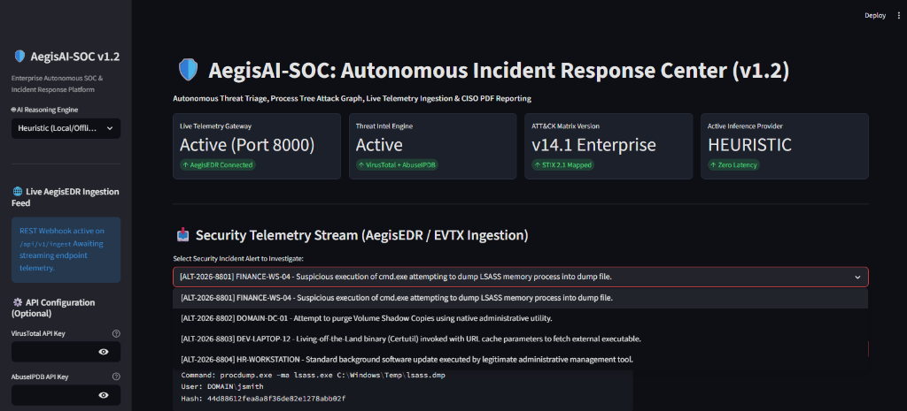
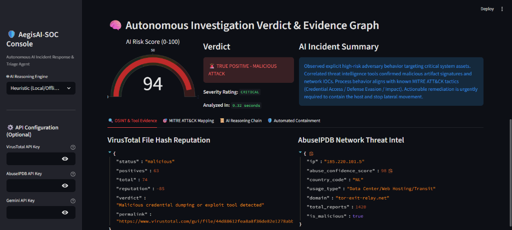
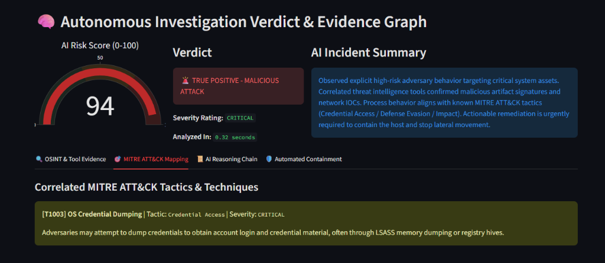
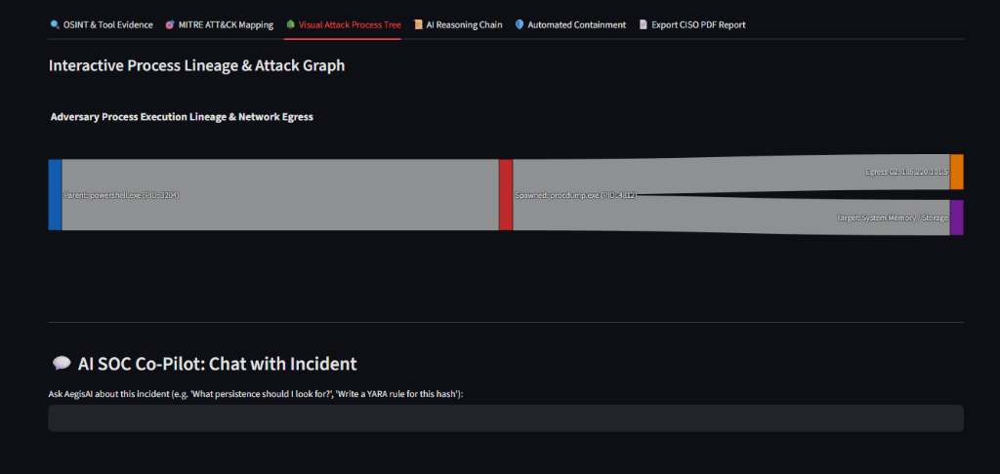
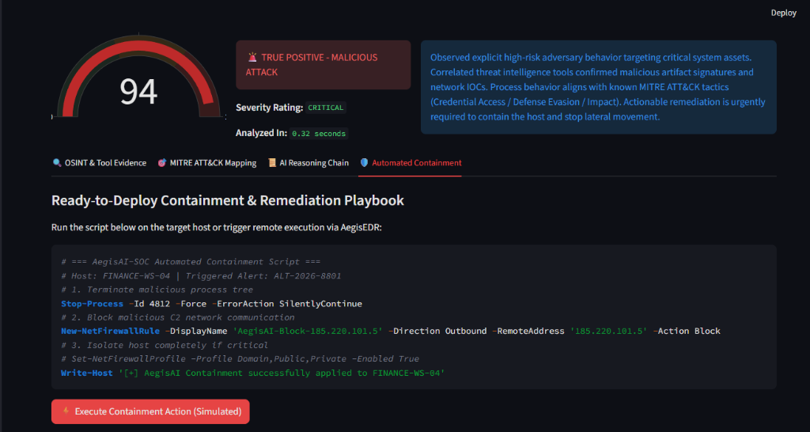
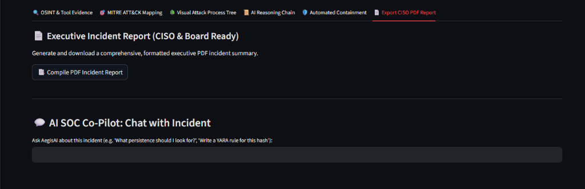

# 🛡️ AegisAI-SOC (v1.2.0): Autonomous AI Incident Response & Triage Agent

[](https://github.com/sultanbajamil/AegisAI-SOC/releases/tag/v1.2.0)
[](https://www.python.org/)
[](LICENSE)
[](https://attack.mitre.org/)
[](https://fastapi.tiangolo.com/)
[]()

**AegisAI-SOC** is an enterprise-grade autonomous Security Operations Center (SOC) platform designed to automate L1/L2 triage, alert correlation, threat intelligence enrichment, and incident response workflows. It operates as an autonomous ReAct agent evaluating incoming endpoint/network alerts (from **AegisEDR** or Windows Event Logs), executes real-time OSINT investigations, maps adversary tactics to **MITRE ATT&CK**, calculates dynamic risk scores, visualizes process lineages, and generates actionable host containment playbooks.

---

## 📸 Interactive Web Dashboard Preview (v1.2)

### 1. Alert Ingestion & Security Telemetry Stream (v1.2)
Ingests live process alerts, LOLbin commands, network destinations, and file hashes from AegisEDR or Windows Event Logs. Shows live telemetry port status and active inference provider.


### 2. Autonomous Investigation Verdict & OSINT Evidence
Autonomous ReAct agent checks VirusTotal reputation, queries AbuseIPDB threat intelligence, and calculates a dynamic 0–100 risk score in 0.32 seconds.


### 3. MITRE ATT&CK Tactic & Technique Correlation
Adversary tactics and techniques (e.g., `[T1003] OS Credential Dumping`) correlated directly from raw command line arguments and process attributes.


### 4. Interactive Attack Process Lineage Graph (New in v1.2)
Visualizes the execution progression from parent process (`powershell.exe`) to spawned binary (`procdump.exe`), target memory space (`lsass.exe`), and C2 network egress IP (`185.220.101.5`).


### 5. Automated Host Containment Playbook
Generates target host remediation scripts (process tree termination & firewall isolation) executable with one click.


### 6. CISO & Board-Ready PDF Report Export (New in v1.2)
Compiles comprehensive post-incident executive summaries, technical artifact matrices, and containment validation into downloadable PDFs.


---

## 🚀 Key Features in v1.2.0

- 🌳 **Visual Attack Process Tree:** Interactive Sankey diagram showing process execution chains and egress connections.
- 📄 **Executive CISO PDF Reporting:** Instant compilation of compliance-ready incident summary reports.
- 💬 **AI SOC Co-Pilot:** Interactive chat assistant generating on-the-fly **YARA rules** and persistence audit guidance.
- 🌐 **Real-Time AegisEDR Ingestion API (`/api/v1/ingest`):** Built-in FastAPI webhook gateway allowing external EDR sensors to push live telemetry.
- 🤖 **Hybrid AI Inference (100% Free or Cloud Powered):**
  - **Local Offline Models:** Connects to local **Ollama** (`llama3.2`, `mistral`, `qwen2.5-coder`).
  - **Free Cloud APIs:** Plug-and-play toggle for **Google Gemini 1.5 Flash** or **Groq Llama-3**.
  - **Zero-Dependency Heuristic Engine:** In-memory rule reasoning engine that works immediately without API keys or GPU.

---

## 📁 Project Architecture

```
AegisAI-SOC/
├── core/
│   ├── agent.py              # Autonomous ReAct SOC investigation loop
│   ├── api.py                # FastAPI real-time EDR ingestion endpoint
│   └── llm_provider.py       # Provider factory: Ollama, Gemini, Groq, Heuristic
├── tools/
│   ├── threat_intel.py       # VirusTotal, AbuseIPDB, MITRE ATT&CK, LOLbin analyzers
│   └── report_generator.py   # Executive PDF incident report compiler
├── dashboard/
│   └── app.py                # Interactive Streamlit SOC Analyst Web Console
├── data/
│   ├── mitre_attack.json     # Offline MITRE ATT&CK database
│   └── samples/              # Pre-configured realistic incident telemetry
├── docs/
│   ├── images/               # Dashboard screenshots and UI walkthroughs
│   └── Sample_Incident_Report_ALT-2026-8801.pdf
├── tests/
│   └── test_investigation.py # Pytest test suite
├── main.py                   # CLI entrypoint
├── requirements.txt          # Python dependencies
└── .env.example              # Environment configuration template
```

---

## 🚀 Quickstart & Usage

### 1. Installation
```powershell
git clone https://github.com/sultanbajamil/AegisAI-SOC.git
cd AegisAI-SOC
pip install -r requirements.txt
```

### 2. Run Autonomous CLI Triage
```powershell
python main.py --contain
```

### 3. Launch Interactive SOC Dashboard
```powershell
streamlit run dashboard/app.py
```
Open `http://localhost:8501` to access the console.

### 4. Run Real-Time Ingestion Gateway (Optional)
```powershell
uvicorn core.api:app --host 0.0.0.0 --port 8000
```

---

## 📜 License
This project is licensed under the MIT License - see the [LICENSE](LICENSE) file for details.
